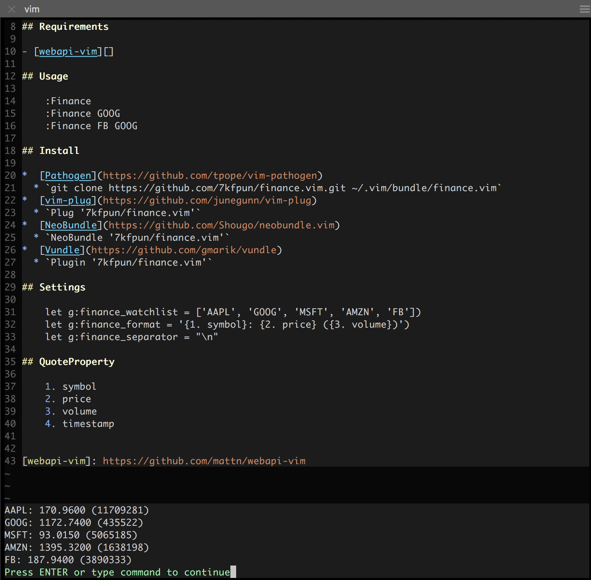

## finance.vim 

Check Stocks and Exchange Rates in Vim (Alpha Vantage and 126).



## Requirements

- [webapi-vim](https://github.com/mattn/webapi-vim)

## Usage

    " For US Stocks only
    :Finance
    :Finance GOOG
    :Finance FB GOOG

    :FinanceCn 1000001  " For Shenzhen Stocks
    :FinanceCn 0601939  " For Shanghai Stocks
    :FinanceCn hkHSI hk00005  " For Hong Kong Stocks
    :FinanceCn US_GOOG US_AAPL  " For US Stocks

    :Exchange
    :Exchange USD HKD
    :Exchange BTC USD
    " It can either be a [physical currency](https://www.alphavantage.co/physical_currency_list/) or [digital/crypto currency](https://www.alphavantage.co/digital_currency_list/)

## Install

*  [Pathogen](https://github.com/tpope/vim-pathogen)
    ```
    git clone https://github.com/7kfpun/finance.vim.git ~/.vim/bundle/finance.vim
    git clone https://github.com/mattn/webapi-vim.git ~/.vim/bundle/webapi-vim
    ```

*  [vim-plug](https://github.com/junegunn/vim-plug)
    ```
    Plug '7kfpun/finance.vim'
    Plug 'mattn/webapi-vim'
    ```

*  [NeoBundle](https://github.com/Shougo/neobundle.vim)
    ```
    NeoBundle '7kfpun/finance.vim'
    NeoBundle 'mattn/webapi-vim'
    ```

* [Vundle](https://github.com/gmarik/vundle)
    ```
    Plugin '7kfpun/finance.vim'
    Plugin 'mattn/webapi-vim'
    ```

## Settings

    let g:finance_watchlist = ['AAPL', 'GOOG', 'MSFT', 'AMZN', 'FB'])
    let g:finance_format = '{1. symbol}: {2. price} ({3. volume})')
    let g:finance_cn_format', '{name}: {price} ({updown}/{percent}%)'
    let g:finance_separator = "\n"

    let g:exchange_currencies = ['BTC', 'USD']
    let g:exchange_format = '1 {1. From_Currency Code} = {5. Exchange Rate} {3. To_Currency Code}'

## Formatting

    " Finance
    1. symbol
    2. price
    3. volume
    4. timestamp

    " FinanceCn
    code
    percent
    high
    askvol3
    askvol2
    askvol5
    askvol4
    price
    open
    bid5
    bid4
    bid3
    bid2
    bid1
    low
    updown
    type
    bidvol1
    status
    bidvol3
    bidvol2
    symbol
    update
    bidvol5
    bidvol4
    volume
    askvol1
    ask5
    ask4
    ask1
    name
    ask3
    ask2
    arrow
    time
    yestclose
    turnover

    " Exchange
    1. From_Currency Code
    2. From_Currency Name
    3. To_Currency Code
    4. To_Currency Name
    5. Exchange Rate
    6. Last Refreshed
    7. Time Zone


## License

Released under the [MIT License](http://opensource.org/licenses/MIT).
